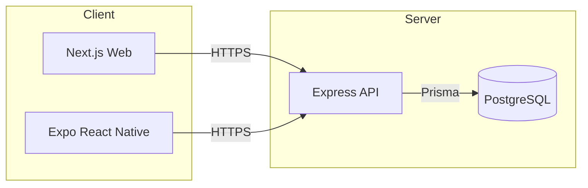

# Architecture Overview

This repository is a monorepo that contains three applications: a Next.js web app, an Expo React Native mobile app, and an Express API backed by PostgreSQL via Prisma. Authentication is handled via Google OAuth 2.0 with refresh tokens for indefinite access, email/password authentication, and application JWTs.



## 1. Repository Structure

```
/ (repo root)
├── apps/
│   ├── api/                      # Express API (TypeScript)
│   │   ├── prisma/
│   │   │   ├── schema.prisma     # DB schema & relations
│   │   │   └── seed.ts           # Sample data seed
│   │   └── src/
│   │       └── index.ts          # API entrypoint, routes, auth
│   ├── web/                      # Next.js (App Router)
│   │   ├── app/
│   │   │   ├── page.tsx          # Dashboard (Gmail/Drive tabs)
│   │   │   ├── product/page.tsx  # Products
│   │   │   ├── order/page.tsx    # Orders
│   │   │   ├── auth/             # Email/password auth
│   │   │   │   ├── login/page.tsx
│   │   │   │   └── signup/page.tsx
│   │   │   ├── google-oauth/     # Google auth UI
│   │   │   │   ├── login/page.tsx
│   │   │   │   └── success/page.tsx
│   │   │   ├── middleware.ts     # Route protection
│   │   │   └── globals.css       # Shared styles
│   │   └── jest.config.ts        # Web Jest config
│   └── mobile/                   # Expo (managed)
│       ├── app/                  # Expo Router screens
│       │   ├── _layout.tsx
│       │   ├── index.tsx
│       │   ├── product.tsx
│       │   └── order.tsx
│       ├── metro.config.js       # Monorepo-safe Metro
│       ├── jest.config.js        # Mobile Jest preset (deferred)
│       └── jest.setup.ts         # Mobile test setup (mocked)
├── .github/workflows/ci.yml      # CI (builds/tests)
├── ARCHITECTURE.md               # This document
├── TECHNICAL.md                  # Technical setup/reference
├── DEVELOPMENT_SETUP.md          # Local dev instructions
├── package.json                  # Workspaces + root scripts
└── .env / .env.example           # Environment variables
```

## 2. Key Technologies

- Web: Next.js 15 (App Router), React 19
- Mobile: Expo (managed), React Native, Expo Router
- API: Node.js, Express, TypeScript
- Database: PostgreSQL + Prisma ORM
- Auth: Google OAuth 2.0 (with refresh tokens) + Email/Password + JWT
- Testing: Jest (+ RTL for web), Supertest for API
- Linting/Formatting: ESLint, Prettier
- CI: GitHub Actions (build/test)

## 3. Environment Variables

Set at repo root in `.env` (see `.env.example`):

- DATABASE_URL: PostgreSQL connection string
- JWT_SECRET: Application JWT signing secret
- VERCEL_ENV: development | preview | production
- NEXT_PUBLIC_API_BASE_URL: http://localhost:3001 (web → api)
- EXPO_PUBLIC_API_BASE_URL: http://<LAN-IP>:3001 (mobile → api)
- GOOGLE_CLIENT_ID: Google OAuth client id
- GOOGLE_CLIENT_SECRET: Google OAuth client secret
- GOOGLE_REDIRECT_URI: http://localhost:3001/api/auth/google/callback
- WEB_BASE_URL: http://localhost:3000 (optional, defaults to localhost)

## 4. Database Schema (Prisma)

Core models are defined in `apps/api/prisma/schema.prisma`.

- User: basic profile, email, password (hashed), mobile, role
- GoogleAccount: 1:1 with User; stores Google identity and tokens (access/refresh)
- Product / Order: sample domain models
- Role enum: admin, user

Relations:

- User 1—n Order
- User 1—1 GoogleAccount
- Order n—1 Product

Seeding: run `npm --prefix apps/api run seed` to populate sample users, products, and an order.

## 5. Authentication & Authorization

### 5.1 Google OAuth 2.0 with Refresh Tokens

Implemented via `google-auth-library` with these scopes:

- openid, email, profile
- https://www.googleapis.com/auth/drive.readonly
- https://www.googleapis.com/auth/gmail.readonly

**Key Configuration for Indefinite Access:**
- `access_type: "offline"` - Required to get refresh tokens
- `prompt: "consent"` - Ensures refresh token is provided even on re-authorization

**OAuth Flow:**
1) Web hits `GET /api/auth/google/start` → redirects to Google consent
2) Google redirects back to `GET /api/auth/google/callback?code=...`
3) API exchanges code for tokens, verifies ID token, upserts `GoogleAccount`
4) API issues app JWT and redirects to web `google-oauth/success?token=...`

**Token Storage (Prisma `GoogleAccount`):**
- googleId, email, name, picture
- accessToken (expires in 1 hour), refreshToken (never expires unless revoked)
- expiresAt (access token expiration)

**Refresh Token System:**
- Access tokens expire after 1 hour
- System automatically detects expiration (with 5-minute buffer)
- Uses refresh token to get new access token
- Updates database with new access token
- Process repeats indefinitely until user revokes access

**Endpoints:**
- GET `/api/auth/google/start` — begin OAuth
- GET `/api/auth/google/callback` — handle Google redirect, issue JWT
- GET `/api/auth/google/account` — current user's Google account info
- POST `/api/auth/google/refresh` — manually refresh access token
- POST `/api/auth/google/disconnect` — revoke and clear stored tokens
- GET `/api/gmail/messages` — Gmail API access (with auto-refresh)
- GET `/api/drive/files` — Google Drive API access (with auto-refresh)

### 5.2 Email/Password Authentication

**Registration:**
- POST `/api/auth/register` — create account with email, password, name, mobile
- Passwords are hashed using bcryptjs
- Issues JWT on successful registration

**Login:**
- POST `/api/auth/login-email` — authenticate with email and password
- Verifies password hash
- Issues JWT on successful login

**Password Security:**
- Passwords hashed with bcryptjs (12 rounds)
- Mobile field required for registration
- Name field optional

### 5.3 Application JWTs

- Issued by API on successful Google OAuth or email/password login
- Contain `{ id: string, role: "user" | "admin" }`
- Sent as `Authorization: Bearer <token>` to protected endpoints
- Stored in localStorage and httpOnly cookies

### 5.4 Authorization Middleware (API)

- `authenticateJWT`: verifies JWT, attaches `req.user`
- `requireRole(["admin","user"])`: basic guard used on sample endpoints

### 5.5 Web Route Protection

- Next.js middleware (`apps/web/middleware.ts`) protects all routes
- Redirects unauthenticated users to `/auth/login`
- Preserves intended destination in `next` query parameter
- Allows access to auth pages and static assets

## 6. API Surface

Located in `apps/api/src/index.ts`.

**Health & Auth:**
- `GET /api/health` — health check
- `POST /api/auth/register` — email/password registration
- `POST /api/auth/login-email` — email/password login
- `GET /api/user/me` — current user info (with Google account data)

**Google OAuth:**
- `GET /api/auth/google/start` — begin OAuth flow
- `GET /api/auth/google/callback` — handle OAuth callback
- `GET /api/auth/google/account` — current user's Google account info
- `POST /api/auth/google/refresh` — manually refresh access token
- `POST /api/auth/google/disconnect` — revoke and clear tokens

**Google APIs (with auto-refresh):**
- `GET /api/gmail/messages` — Gmail API access
- `GET /api/drive/files` — Google Drive API access

**Sample Data:**
- Users: `GET /api/user/:id`
- Products: `GET /api/product/:id`, `GET /api/products`
- Orders: `GET /api/order/:id`, `GET /api/orders`

Error handling returns JSON `{ error: string }` with appropriate status codes.

## 7. Web Application (Next.js)

**Pages & Routes:**
- `/` — Dashboard with Gmail and Google Drive tabs
- `/auth/login` — Login page (Google OAuth + Email/Password)
- `/auth/signup` — Registration page (Google OAuth + Email/Password)
- `/google-oauth/login` — Google OAuth initiation
- `/google-oauth/success` — OAuth callback success with auto-redirect
- `/product` — Product listing (protected)
- `/order` — Order listing (protected)

**Features:**
- **Route Protection:** Middleware redirects unauthenticated users to login
- **User Dashboard:** Displays user name and logout functionality
- **Dual Authentication:** Both Google OAuth and email/password options
- **Responsive Design:** Modern UI with Tailwind CSS
- **Token Management:** Automatic JWT handling and storage

**Technical:**
- App Router under `apps/web/app`
- Config helper: `apps/web/lib/config.ts` reads `NEXT_PUBLIC_API_BASE_URL`
- Build: SWC (no project Babel config)
- Dev: Turbopack enabled for faster reloads
- Testing: Jest + RTL (babel-jest used only by Jest, not by Next build)

## 8. Mobile Application (Expo)

- Expo Router in `apps/mobile/app`
- Monorepo-safe Metro config (`disableHierarchicalLookup`, curated `watchFolders`)
- Styling via `StyleSheet` (NativeWind not required)
- Type-check build via `npx tsc --noEmit`
- Testing is deferred; Jest preset and setup exist but are excluded from type-check build
- Config helper: `apps/mobile/lib/config.ts` reads `EXPO_PUBLIC_API_BASE_URL`

## 9. Local Development

Root scripts (`package.json`):

- `npm run dev:web` — Next.js dev (Turbopack)
- `npm run dev:api` — API dev (ts-node-dev)
- `npm run dev:web+api` — run both concurrently
- `npm run dev:mobile` — Expo dev server
- `npm run build` — API → Web → Mobile (type-check)
- `npm run test` — workspace tests

Recommended env for local OAuth:

- `GOOGLE_REDIRECT_URI=http://localhost:3001/api/auth/google/callback`
- Web start: `npm run dev:web`
- API start: `npm run dev:api`
- Visit: `http://localhost:3000/google-oauth/login`

## 10. CI/CD

GitHub Actions workflow at `.github/workflows/ci.yml` builds API, Web, and type-checks Mobile. Cache is configured for Node and npm. Provide required env vars in repository secrets if needed for CI.

## 11. Deployment

- Web: deploy to Vercel (reads `NEXT_PUBLIC_*` variables at build time)
- API: deploy to preferred Node host (ensure `DATABASE_URL`, `JWT_SECRET`, and Google vars)
- Database: managed PostgreSQL (e.g., Supabase, RDS); update `DATABASE_URL`
- Prisma: prefer `prisma migrate deploy` in production; `prisma db push` acceptable for local dev

## 12. Troubleshooting Notes

- Expo monorepo issues typically stem from duplicate React/React Native resolution; the provided `metro.config.js` with `resolver.disableHierarchicalLookup` resolves this.
- If mobile dev server complains about port in non-interactive mode, start Expo manually in an interactive shell.
- If web build fails with next/font + Babel conflict, ensure no project-level `babel.config.js` so SWC is used.
- `JWT secret not configured` errors indicate missing `JWT_SECRET` or `VERCEL_ENV` not set to `development`.

## 13. Google OAuth Refresh Token System

**How Indefinite Access Works:**

1. **Initial Authorization:** User authorizes app → Google provides access_token + refresh_token
2. **Access Token Expiration:** Access tokens expire after 1 hour
3. **Automatic Refresh:** System uses refresh_token to get new access_token
4. **Continuous Access:** Process repeats indefinitely until user revokes access

**Refresh Token Lifespan:**
Refresh tokens can be revoked by:
- User manually revoking access in Google Account settings
- App calling `googleClient.revokeToken()`
- User changing Google password
- 6 months of inactivity (Google's policy)

**Utility Functions:**
- `getValidGoogleAccessToken(userId)` — automatically checks expiration and refreshes if needed
- `refreshGoogleAccessToken(userId)` — manually refreshes access token using refresh token

**Best Practices Implemented:**
- 5-minute buffer before expiration for proactive refresh
- Error handling with graceful fallback
- Database updates with latest tokens and expiration
- Automatic detection requiring no manual intervention
- Secure token storage and management

## 14. Roadmap

- Implement actual Gmail and Google Drive API integrations
- Add email search and file management features
- Expand API tests and add mobile tests when needed
- Production-ready migrations (`prisma migrate`) and CI database checks
- Add user profile management and settings

