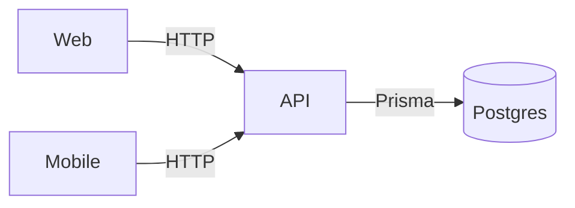

# Architecture

System consists of three apps in a monorepo:

- apps/web: Next.js frontend on Vercel
- apps/mobile: Expo managed React Native app
- apps/api: Express API with Prisma/Postgres

RBAC with roles `admin` and `user` backed by JWTs.

