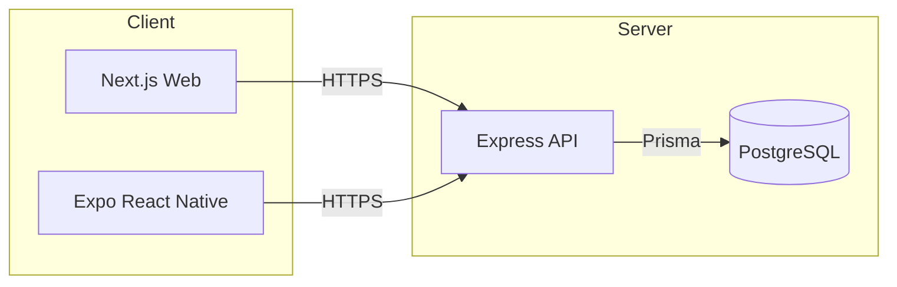

# Architecture Overview

This repository is a monorepo that contains three applications: a Next.js web app, an Expo React Native mobile app, and an Express API backed by PostgreSQL via Prisma. Authentication is handled via Google OAuth 2.0 and application JWTs.



## 1. Repository Structure

```
/ (repo root)
├── apps/
│   ├── api/                      # Express API (TypeScript)
│   │   ├── prisma/
│   │   │   ├── schema.prisma     # DB schema & relations
│   │   │   └── seed.ts           # Sample data seed
│   │   └── src/
│   │       └── index.ts          # API entrypoint, routes, auth
│   ├── web/                      # Next.js (App Router)
│   │   ├── app/
│   │   │   ├── page.tsx          # Home
│   │   │   ├── product/page.tsx  # Products
│   │   │   ├── order/page.tsx    # Orders
│   │   │   └── google-oauth/     # Google auth UI
│   │   │       ├── login/page.tsx
│   │   │       └── success/page.tsx
│   │   └── jest.config.ts        # Web Jest config
│   └── mobile/                   # Expo (managed)
│       ├── app/                  # Expo Router screens
│       │   ├── _layout.tsx
│       │   ├── index.tsx
│       │   ├── product.tsx
│       │   └── order.tsx
│       ├── metro.config.js       # Monorepo-safe Metro
│       ├── jest.config.js        # Mobile Jest preset (deferred)
│       └── jest.setup.ts         # Mobile test setup (mocked)
├── .github/workflows/ci.yml      # CI (builds/tests)
├── ARCHITECTURE.md               # This document
├── TECHNICAL.md                  # Technical setup/reference
├── DEVELOPMENT_SETUP.md          # Local dev instructions
├── package.json                  # Workspaces + root scripts
└── .env / .env.example           # Environment variables
```

## 2. Key Technologies

- Web: Next.js 15 (App Router), React 19
- Mobile: Expo (managed), React Native, Expo Router
- API: Node.js, Express, TypeScript
- Database: PostgreSQL + Prisma ORM
- Auth: Google OAuth 2.0 + JWT
- Testing: Jest (+ RTL for web), Supertest for API
- Linting/Formatting: ESLint, Prettier
- CI: GitHub Actions (build/test)

## 3. Environment Variables

Set at repo root in `.env` (see `.env.example`):

- DATABASE_URL: PostgreSQL connection string
- JWT_SECRET: Application JWT signing secret
- VERCEL_ENV: development | preview | production
- NEXT_PUBLIC_API_BASE_URL: http://localhost:3001 (web → api)
- EXPO_PUBLIC_API_BASE_URL: http://<LAN-IP>:3001 (mobile → api)
- GOOGLE_CLIENT_ID: Google OAuth client id
- GOOGLE_CLIENT_SECRET: Google OAuth client secret
- GOOGLE_REDIRECT_URI: http://localhost:3001/api/auth/google/callback
- WEB_BASE_URL: http://localhost:3000 (optional, defaults to localhost)

## 4. Database Schema (Prisma)

Core models are defined in `apps/api/prisma/schema.prisma`.

- User: basic profile and auth linkage
- GoogleAccount: 1:1 with User; stores Google identity and tokens
- Product / Order: sample domain models
- Role enum: global_admin, family_admin, family_member, advisor

Relations:

- User 1—n Order
- User 1—1 GoogleAccount
- Order n—1 Product

Seeding: run `npm --prefix apps/api run seed` to populate sample users, products, and an order.

## 5. Authentication & Authorization

### 5.1 Google OAuth 2.0

Implemented via `google-auth-library` with these scopes:

- openid, email, profile
- https://www.googleapis.com/auth/drive.readonly
- https://www.googleapis.com/auth/gmail.readonly

Flow:

1) Web hits `GET /api/auth/google/start` → redirects to Google consent
2) Google redirects back to `GET /api/auth/google/callback?code=...`
3) API exchanges code for tokens, verifies ID token, upserts `GoogleAccount`
4) API issues app JWT and redirects to web `google-oauth/success?token=...`

Token storage (Prisma `GoogleAccount`):

- googleId, email, name, picture
- accessToken, refreshToken, expiresAt

Endpoints:

- GET `/api/auth/google/start` — begin OAuth
- GET `/api/auth/google/callback` — handle Google redirect, issue JWT
- GET `/api/auth/google/account` — current user’s Google account info
- POST `/api/auth/google/disconnect` — revoke and clear stored tokens

Notes:

- API uses `JWT_SECRET` for signing and verification. In development, a safe default is used if `VERCEL_ENV=development` and `JWT_SECRET` is missing.
- Web reads the token on `/google-oauth/success` and can persist it (e.g., localStorage) for authenticated API calls.

### 5.2 Application JWTs

- Issued by API on successful Google login
- Contain `{ id: string, role: "user" }`
- Sent as `Authorization: Bearer <token>` to protected endpoints

### 5.3 Authorization Middleware (API)

- `authenticateJWT`: verifies JWT, attaches `req.user`
- `requireRole(["admin","user"])`: basic guard used on sample endpoints

## 6. API Surface

Located in `apps/api/src/index.ts`.

- Health: `GET /api/health`
- Auth (temporary): `POST /api/auth/login` — issues JWT for existing user email
- Users: `GET /api/user/:id`
- Products: `GET /api/product/:id`, `GET /api/products`
- Orders: `GET /api/order/:id`, `GET /api/orders`
- Google OAuth: start, callback, account, disconnect (see above)

Error handling returns JSON `{ error: string }` with appropriate status codes.

## 7. Web Application (Next.js)

- App Router under `apps/web/app`
- Pages: `/`, `/product`, `/order`, `/google-oauth/login`, `/google-oauth/success`
- Config helper: `apps/web/lib/config.ts` reads `NEXT_PUBLIC_API_BASE_URL`
- Build: SWC (no project Babel config)
- Dev: Turbopack enabled for faster reloads
- Testing: Jest + RTL (babel-jest used only by Jest, not by Next build)

## 8. Mobile Application (Expo)

- Expo Router in `apps/mobile/app`
- Monorepo-safe Metro config (`disableHierarchicalLookup`, curated `watchFolders`)
- Styling via `StyleSheet` (NativeWind not required)
- Type-check build via `npx tsc --noEmit`
- Testing is deferred; Jest preset and setup exist but are excluded from type-check build
- Config helper: `apps/mobile/lib/config.ts` reads `EXPO_PUBLIC_API_BASE_URL`

## 9. Local Development

Root scripts (`package.json`):

- `npm run dev:web` — Next.js dev (Turbopack)
- `npm run dev:api` — API dev (ts-node-dev)
- `npm run dev:web+api` — run both concurrently
- `npm run dev:mobile` — Expo dev server
- `npm run build` — API → Web → Mobile (type-check)
- `npm run test` — workspace tests

Recommended env for local OAuth:

- `GOOGLE_REDIRECT_URI=http://localhost:3001/api/auth/google/callback`
- Web start: `npm run dev:web`
- API start: `npm run dev:api`
- Visit: `http://localhost:3000/google-oauth/login`

## 10. CI/CD

GitHub Actions workflow at `.github/workflows/ci.yml` builds API, Web, and type-checks Mobile. Cache is configured for Node and npm. Provide required env vars in repository secrets if needed for CI.

## 11. Deployment

- Web: deploy to Vercel (reads `NEXT_PUBLIC_*` variables at build time)
- API: deploy to preferred Node host (ensure `DATABASE_URL`, `JWT_SECRET`, and Google vars)
- Database: managed PostgreSQL (e.g., Supabase, RDS); update `DATABASE_URL`
- Prisma: prefer `prisma migrate deploy` in production; `prisma db push` acceptable for local dev

## 12. Troubleshooting Notes

- Expo monorepo issues typically stem from duplicate React/React Native resolution; the provided `metro.config.js` with `resolver.disableHierarchicalLookup` resolves this.
- If mobile dev server complains about port in non-interactive mode, start Expo manually in an interactive shell.
- If web build fails with next/font + Babel conflict, ensure no project-level `babel.config.js` so SWC is used.
- `JWT secret not configured` errors indicate missing `JWT_SECRET` or `VERCEL_ENV` not set to `development`.

## 13. Roadmap

- Secure web-side token persistence and logout UX
- Surface Google account info in the web UI and allow disconnect
- Add read-only Gmail/Drive views using Google APIs
- Expand API tests and add mobile tests when needed
- Production-ready migrations (`prisma migrate`) and CI database checks

