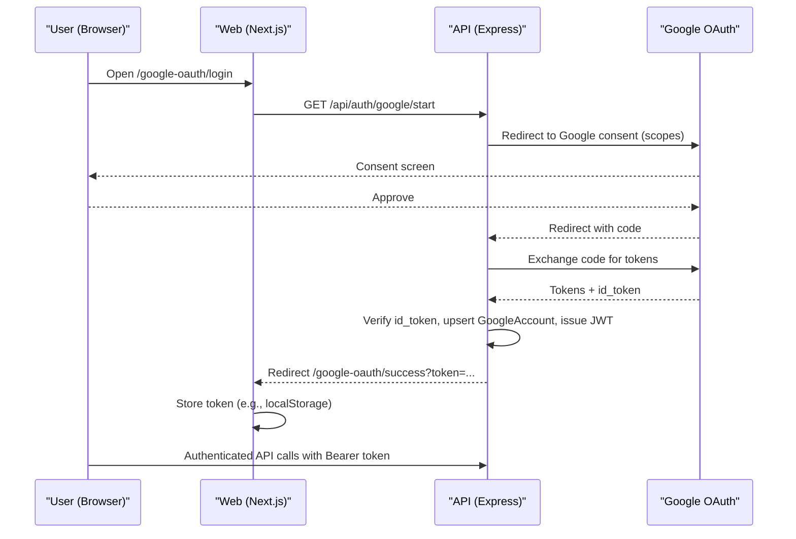

# MidasMaker

A monorepo with Web (Next.js), Mobile (Expo), and API (Express + Prisma). Google OAuth 2.0 is the sole login method; the API issues JWTs for app auth.

## Project Structure

```
apps/
  api/    # Express API (TypeScript) + Prisma/Postgres
  web/    # Next.js (App Router) web app
  mobile/ # Expo (managed) React Native app
```

## Prerequisites

- Node.js 20+
- PostgreSQL (local or managed)

## Environment Variables

Create `.env` at the repo root (see `.env.example`):

- DATABASE_URL=postgres://...
- JWT_SECRET=dev_jwt_secret
- VERCEL_ENV=development
- NEXT_PUBLIC_API_BASE_URL=http://localhost:3001
- EXPO_PUBLIC_API_BASE_URL=http://<your-lan-ip>:3001
- GOOGLE_CLIENT_ID=...
- GOOGLE_CLIENT_SECRET=...
- GOOGLE_REDIRECT_URI=http://localhost:3001/api/auth/google/callback
- WEB_BASE_URL=http://localhost:3000 (optional)

## Scripts

From the repo root:

- Dev: `npm run dev:web+api` (Next.js + API)
- Web only: `npm run dev:web`
- API only: `npm run dev:api`
- Mobile: `npm run dev:mobile`
- Build all: `npm run build` (API → Web → Mobile type-check)
- Tests: `npm test` (API/Web configured; mobile tests deferred)

## Google OAuth Flow



API endpoints:

- `GET /api/auth/google/start`
- `GET /api/auth/google/callback`
- `GET /api/auth/google/account`
- `POST /api/auth/google/disconnect`

## Database & Prisma

- Schema: `apps/api/prisma/schema.prisma`
- Dev sync: `npm --prefix apps/api run prisma:push` (or `prisma db push`)
- Seed: `npm --prefix apps/api run seed`

## Web App

- Dev: Turbopack
- Build: SWC (no project Babel config)
- Pages: `/`, `/product`, `/order`, `/google-oauth/login`, `/google-oauth/success`

## Mobile App

- Expo Router screens in `apps/mobile/app`
- Metro configured for monorepo (no duplicate React/React Native)
- Type-check build only (tests excluded)

## CI

GitHub Actions at `.github/workflows/ci.yml` builds API, Web, and type-checks Mobile.

## Troubleshooting

- JWT error: ensure `JWT_SECRET` or set `VERCEL_ENV=development` for dev default
- next/font + Babel conflict: ensure no `babel.config.js` in web so SWC is used
- Expo port prompt: start Expo in interactive shell or free port 8081

## Links

- Architecture: `ARCHITECTURE.md`
- Technical details: `TECHNICAL.md`


